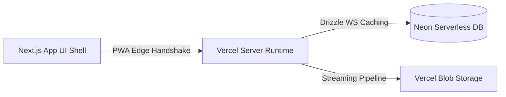

# ☀️ BOB Solar — Premium Operations Engine

<div align="center">
  <p><strong>A high-performance, beautiful Progressive Web Application built for boutique solar installation management.</strong></p>
  <p>Engineered for instantaneous hydration, absolute network parallelization, and zero-latency operational control. Designed with an immersive, enterprise-grade aesthetic that prioritizes readability, context, and a bento-style fluid layout.</p>
</div>

<p align="center">
  
  
  
  
  
  
</p>

---

## ✨ System Architecture

BOB Solar uses a highly decoupled **Server Component + Client Island** hybrid architecture built on top of Next.js App Router and serverless edge tools. It strictly adheres to **Single Source of Truth (SSoT)** principles and **Double-Entry Accounting**.



### Strategic Objectives

- **Zero Layout Shifts (CLS)**: Initial shells render purely on the server, forwarding pre-fetched static state directly into interactive hydration boundaries.
- **Concurrent DB Execution**: Independent dashboard aggregates and heavy table-scan workflows fire concurrently via array-mapped `Promise.all` resolution loops.
- **Dynamic Lazy Boundaries**: PDF rendering cores (`@react-pdf/renderer`) and dense analytical chart sheets remain dynamically separated (`next/dynamic`) until directly requested by the client.

---

## 🧭 The "Solar Flow" Operational Sequence

```
[ Customers / Suppliers ] ──► [ Catalog / Warehouse ] ──► [ Quotation Engine ] ──► [ Executable Projects ] ──► [ Warranty Care ]
```

1. **Client & Leads Registration**: Managed with structured PostgreSQL state histories tracking active deployment addresses.
2. **SSoT Catalog & Warehouse**: Live price ledgers managed centrally. Real warehouse stock quantities are securely tracked through strict Double-Entry ledger constraints linked to Purchase Orders.
3. **Quotation Dossier Generation**: Fully interactive line-item builders capturing immutable pricing snapshots supporting custom discount calculations and custom layout streaming to branded PDF downloads.
4. **Active Project Commissioning**: Live cost tracking tracking itemized labor, logistics, and material disbursements against projected limits, publishing real-time budget overruns automatically.
5. **Aftersales Warranty Cadence**: Long-term tracking triggers signaling automated component follow-ups, system inversions, and hardware warranty alerts.

---

## 🚀 Quick Start Guide

### 1. Requirements & Setup

Ensure you have `pnpm` v11+ and Node.js v20+ configured locally.

```bash
# Clone and install locked dependencies
pnpm install
```

### 2. Environment Variables

Clone the runtime mapping template:

```bash
cp .env.example .env.local
```

Configure local environment keys within `.env.local`:

- `DATABASE_URL`: Connection string to your primary Neon Serverless instance.
- `TEST_DATABASE_URL`: Dedicated branch string for end-to-end integration verifications.
- `SESSION_SECRET`: 32-character secure secret string signing `httpOnly` auth cookies.
- `BLOB_READ_WRITE_TOKEN`: Vercel Blob API key enabling logo asset streaming.

### 3. Database Setup & Baseline Data

Provision your database schema definitions and inject standard configurations:

```bash
# Run controlled SQL migrations against your development database
pnpm db:migrate

# Seed basic inventory items and default settings
pnpm db:seed
```

> **Production note:** Always use `pnpm db:migrate` (not push) for production databases.
> For the isolated test database use `pnpm db:migrate:test`.

### 4. Local Development Server

Start the client server environment:

```bash
pnpm dev
```

Navigate to `http://localhost:3000` to interact with the application.

---

## ✅ Quality Scripts & Health Checks

Use these `pnpm` scripts to keep code, tests, and DB checks green before deployment.

### Core Quality Gates

- `pnpm green:code`: Runs code-only gate: strict typecheck, Biome linting/formatting, and non-DB unit tests.
- `pnpm green:db`: Runs DB gate on test database via `pnpm test:db`.
- `pnpm green`: Full local CI gate: `green:code` → `green:db` → production build.

### Lint & Formatting

- `pnpm biome:check`: Runs Biome lint rules and formatting diagnostics.
- `pnpm biome:fix`: Applies safe Biome lint fixes and formatting automatically.
- `pnpm typecheck`: Validates TypeScript strict constraints without emitting output.

### Database Health & Operations

- `pnpm db:migrate`: Runs controlled SQL migrations against the database (use for **development and production**).
- `pnpm db:migrate:test`: Syncs schema to the isolated test database (`TEST_DATABASE_URL`) before running integration tests.
- `pnpm db:baseline`: Backfills the Drizzle migrations history if the database is ahead of local tracking.
- `pnpm db:test:ping`: Quick connectivity probe for your `TEST_DATABASE_URL`.

> ⚠️ **Production deployments must use `pnpm db:migrate`** (uses `DATABASE_URL_DIRECT`).
> Never use push-style schema sync against a production database — it bypasses migration history and is irreversible.

**Recommended Daily Flow:**
1. `pnpm green:code` during feature work.
2. `pnpm db:migrate` to apply any new schema migrations.
3. `pnpm green` as the final deploy gate before merging to production.

---

## 📁 Repository Map

```text
bobsolar/
├── src/
│   ├── app/           # Hybrid Server Components & Route API Handlers
│   ├── actions/       # Server Actions handling secure transactional logic
│   ├── components/    # Reusable "Solar Flow" interface components & islands
│   ├── hooks/         # Typed TanStack Query data synchronization wrappers
│   ├── lib/           # Core configuration helpers: auth, db, pricing, validators
│   └── stores/        # Zustand global interface settings stores
├── docs/              # CODE_WIKI.md
├── drizzle/           # Serialized SQL schema migrations
└── public/            # Standalone static media and PWA launcher icons
```

---

## 📜 Legal & Usage

Private proprietary operations portal built exclusively for **BOB Solar** internal workflows. All rights reserved.
