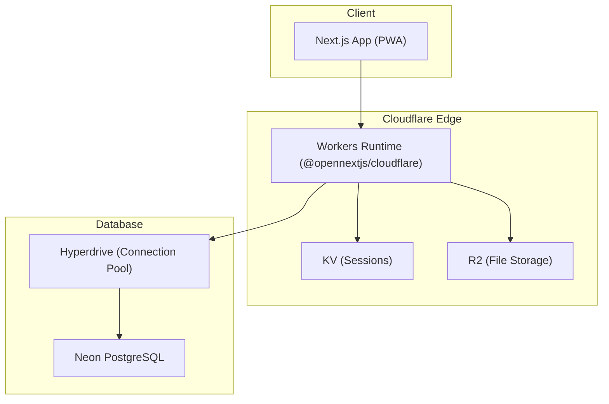
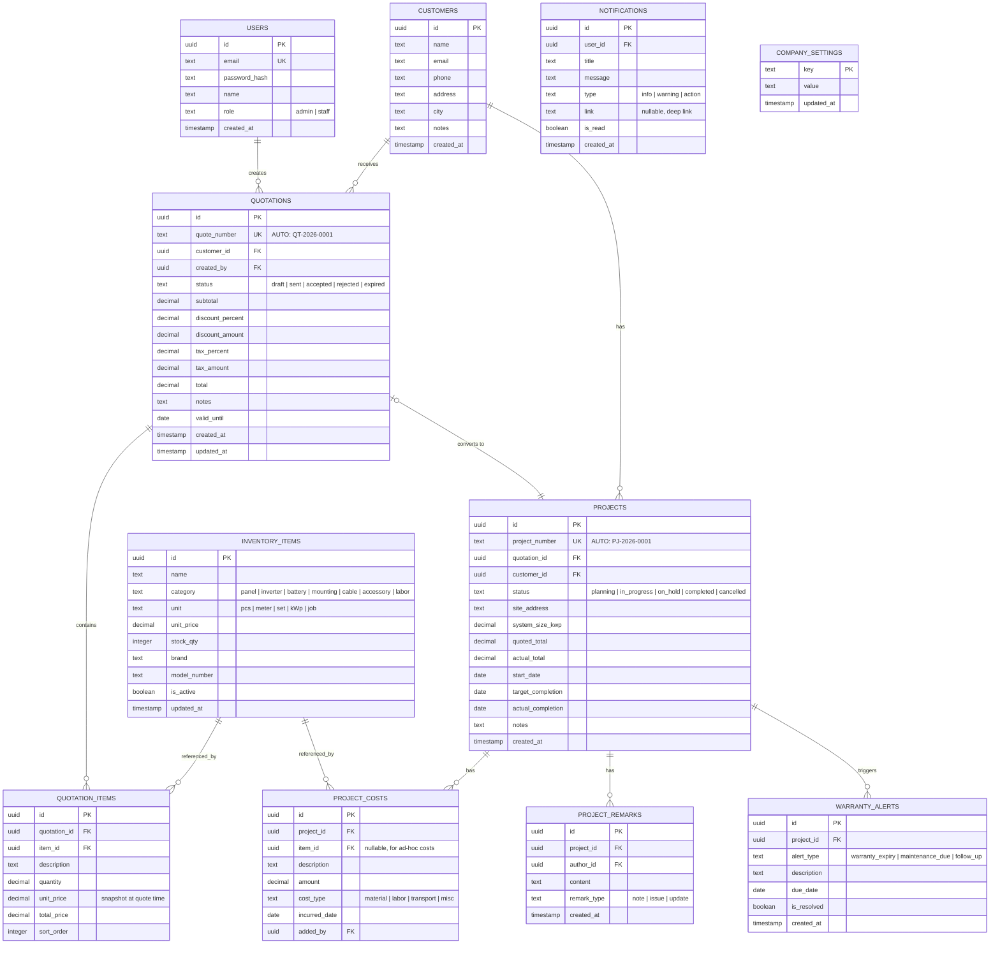
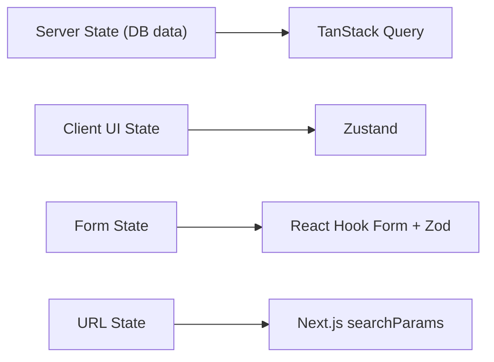
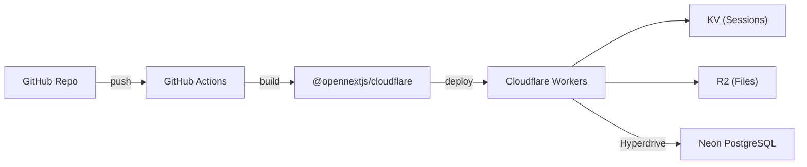

# BOB Solar — Full Implementation Plan

## 1. Project Architecture

### Core Decisions

| Decision | Choice | Rationale |
|---|---|---|
| **Framework** | Next.js 16.2+ (App Router) | RSC, Server Actions, PPR, Turbopack |
| **Runtime** | Cloudflare Workers via `@opennextjs/cloudflare` | Edge-first, full SSR support |
| **Database** | Neon PostgreSQL + Cloudflare Hyperdrive | D1 is SQLite-only; Neon gives real Postgres |
| **ORM** | Drizzle ORM (`pg` dialect) | Type-safe, lightweight, edge-compatible |
| **Auth** | Custom session-based (KV store) | Simple, no third-party dependency |
| **Storage** | Cloudflare R2 (S3-compatible) | Photos, PDF assets, company logos |
| **Cache/Session** | Cloudflare KV | Sub-ms reads, TTL-based sessions |
| **PDF** | `@react-pdf/renderer` via Route Handler | Server-side generation, streaming response |
| **PWA** | Serwist (`@serwist/next`) | Modern, maintained, Next.js native |
| **Package Manager** | pnpm | Fast, strict, disk-efficient |
| **TypeScript** | 6.0 (latest stable, strict mode) | TS 5.9 is outdated; 6.0 is current |

> [!IMPORTANT]
> **Cloudflare D1 is SQLite-based, NOT PostgreSQL.** We use **Neon Postgres + Hyperdrive** for the relational DB, **D1 is dropped**. R2 and KV remain as specified.

### Architecture Diagram



---

## 2. Folder Structure

```
bobsolar/
├── public/
│   ├── icons/                    # PWA icons (192, 512)
│   ├── fonts/                    # Self-hosted fonts
│   └── sw.js                     # Generated service worker
├── src/
│   ├── app/
│   │   ├── (auth)/
│   │   │   ├── login/page.tsx
│   │   │   └── layout.tsx
│   │   ├── (dashboard)/
│   │   │   ├── layout.tsx        # Main app shell layout
│   │   │   ├── page.tsx          # Dashboard home
│   │   │   ├── quotations/
│   │   │   │   ├── page.tsx      # List
│   │   │   │   ├── new/page.tsx  # Create
│   │   │   │   └── [id]/
│   │   │   │       ├── page.tsx  # Detail/Edit
│   │   │   │       └── pdf/route.ts  # PDF generation endpoint
│   │   │   ├── projects/
│   │   │   │   ├── page.tsx      # Active projects
│   │   │   │   ├── [id]/page.tsx
│   │   │   │   └── completed/page.tsx
│   │   │   ├── inventory/
│   │   │   │   └── page.tsx      # Price & Stock
│   │   │   ├── customers/
│   │   │   │   ├── page.tsx
│   │   │   │   └── [id]/page.tsx
│   │   │   ├── warranty/
│   │   │   │   └── page.tsx
│   │   │   └── settings/
│   │   │       └── page.tsx
│   │   ├── api/
│   │   │   ├── auth/route.ts
│   │   │   └── upload/route.ts   # R2 presigned URL
│   │   ├── manifest.ts           # PWA manifest
│   │   ├── layout.tsx            # Root layout
│   │   └── globals.css
│   ├── components/
│   │   ├── ui/                   # shadcn/ui (customized)
│   │   ├── layout/
│   │   │   ├── app-shell.tsx     # Main navigation shell
│   │   │   ├── nav-orbit.tsx     # Orbital navigation
│   │   │   └── command-bar.tsx   # Global search/command
│   │   ├── dashboard/
│   │   │   ├── energy-flow.tsx   # Solar energy visualization
│   │   │   ├── sun-gauge.tsx     # Radial metrics
│   │   │   └── activity-stream.tsx
│   │   ├── quotation/
│   │   │   ├── quote-builder.tsx
│   │   │   ├── line-item-row.tsx
│   │   │   └── quote-summary.tsx
│   │   ├── project/
│   │   │   ├── project-card.tsx
│   │   │   ├── project-timeline.tsx
│   │   │   └── cost-tracker.tsx
│   │   ├── pdf/
│   │   │   ├── quote-document.tsx  # @react-pdf template
│   │   │   └── pdf-styles.ts
│   │   └── shared/
│   │       ├── data-table.tsx
│   │       ├── status-badge.tsx
│   │       ├── notification-toast.tsx
│   │       └── theme-toggle.tsx
│   ├── lib/
│   │   ├── db/
│   │   │   ├── index.ts          # Drizzle client init
│   │   │   ├── schema.ts         # All table schemas
│   │   │   └── migrations/
│   │   ├── auth/
│   │   │   ├── session.ts        # KV session helpers
│   │   │   └── middleware.ts
│   │   ├── storage/
│   │   │   └── r2.ts             # R2 upload helpers
│   │   ├── pdf/
│   │   │   └── generator.ts      # PDF render helpers
│   │   ├── pricing/
│   │   │   └── engine.ts         # Price calculation logic
│   │   ├── validators/           # Zod schemas
│   │   │   ├── quotation.ts
│   │   │   ├── project.ts
│   │   │   ├── customer.ts
│   │   │   └── inventory.ts
│   │   └── utils.ts
│   ├── hooks/
│   │   ├── use-quotations.ts
│   │   ├── use-projects.ts
│   │   ├── use-notifications.ts
│   │   └── use-debounce.ts
│   ├── stores/
│   │   ├── ui-store.ts           # Theme, sidebar, modals
│   │   ├── notification-store.ts
│   │   └── quote-builder-store.ts
│   ├── actions/                  # Server Actions
│   │   ├── quotation-actions.ts
│   │   ├── project-actions.ts
│   │   ├── customer-actions.ts
│   │   ├── inventory-actions.ts
│   │   └── auth-actions.ts
│   ├── types/
│   │   └── index.ts
│   └── sw.ts                     # Service worker source
├── drizzle/
│   └── migrations/
├── drizzle.config.ts
├── next.config.ts
├── wrangler.jsonc
├── tailwind.config.ts
├── components.json               # shadcn config
├── tsconfig.json
├── package.json
└── .env.local
```

---

## 3. Database Schema

### Entity Relationship Diagram



> [!NOTE]
> `COMPANY_SETTINGS` stores logo URL (R2), company name, address, phone, tax registration, bank details — all used in PDF generation. Simple key-value for flexibility.

---

## 4. UI/UX Direction — "Solar Flow" Design System

### Design Philosophy

**"Solar Flow"** is a calm, premium, futuristic interface inspired by the rhythm of solar energy — sunrise gradients, orbital movements, and ambient glow effects. It rejects the traditional admin dashboard paradigm entirely.

### Color Palette

| Token | Light Mode | Dark Mode (Spotify-inspired) |
|---|---|---|
| `--bg-primary` | `#FAFAF8` warm white | `#121212` true dark |
| `--bg-surface` | `#FFFFFF` | `#181818` |
| `--bg-elevated` | `#F5F3EF` | `#282828` |
| `--accent-solar` | `#F59E0B` amber | `#FBBF24` bright amber |
| `--accent-energy` | `#10B981` emerald | `#34D399` mint |
| `--accent-flow` | `#6366F1` indigo | `#818CF8` soft indigo |
| `--text-primary` | `#1A1A1A` | `#EDEDED` |
| `--text-secondary` | `#6B7280` | `#A1A1A1` |
| `--gradient-solar` | `amber-400 → orange-500` | `amber-300 → orange-400` |
| `--gradient-energy` | `emerald-400 → teal-500` | `emerald-300 → teal-400` |

### Typography

- **Primary:** `Outfit` (headings) — geometric, modern, clean
- **Body:** `Inter` (body text) — highly legible, professional
- **Mono:** `JetBrains Mono` (numbers, codes) — crisp data display

### Navigation — "Orbital Nav" (Not a Sidebar!)

Instead of a traditional left sidebar, use a **bottom dock + floating command bar**:

- **Bottom Dock (mobile + desktop):** 5 primary destinations as icon+label pills with a glowing active indicator. Think macOS Dock meets Spotify bottom nav.
- **Command Bar (`⌘K`):** Floating search/command palette for power users — search customers, jump to quotes, quick actions.
- **Top Bar:** Minimal — logo, notification bell (with pulse animation), user avatar, theme toggle.

### Key Screen Designs

#### Dashboard — "Energy Flow Canvas"
- **NOT** generic stat cards. Instead:
  - **Animated Solar System visualization** — a central sun with orbiting planets representing key metrics (revenue, active projects, pending quotes, warranty alerts). Each planet's size = relative value. Click to drill down.
  - **Energy Flow Sankey-style diagram** — shows pipeline: Leads → Quotes → Projects → Completed. Animated particles flow through the paths.
  - **Activity Stream** — timeline with smooth stagger animations showing recent actions.
  - **Quick Actions** floating panel — "New Quote", "Add Customer", styled as glowing cards.

#### Quotation Builder
- **Split-pane layout:** Left = line items editor (drag-to-reorder), Right = live PDF-like preview
- Items auto-pull from Inventory (with search-as-you-type)
- Running total with tax/discount calculations update in real-time
- Status transitions with smooth morph animations

#### Project Detail
- **Horizontal timeline** at top showing project phases
- **Tab panels** below: Overview, Costs, Remarks, Warranty
- Cost tracker with bar chart showing quoted vs actual
- Add cost/remark via slide-up sheet (mobile) or modal (desktop)

#### Inventory / Price Management
- **Card grid** with category filters (pill tabs)
- Inline editing with optimistic updates
- Stock level indicators with color-coded badges
- Bulk price update support

### Micro-Interactions & Animations (Framer Motion)

| Interaction | Animation |
|---|---|
| Page transitions | Shared layout + crossfade (300ms) |
| List items appear | Staggered fade-up (50ms delay each) |
| Status changes | Morph pill color + icon swap |
| Navigation active | Glow pulse on active dock item |
| Notifications | Slide-in from top-right + fade |
| Card hover | Subtle lift (translateY -2px) + shadow grow |
| Dashboard metrics | Number count-up on mount |
| Delete actions | Scale-down + fade-out |

---

## 5. State Management Strategy



| Layer | Tool | What It Manages |
|---|---|---|
| **Server state** | TanStack Query v5 | All DB data — quotations, projects, customers, inventory. Caching, refetching, optimistic updates. |
| **UI state** | Zustand | Theme preference, notification panel open/closed, modal states, command bar visibility |
| **Form state** | React Hook Form + Zod | All forms — quote builder, customer forms, cost entry. Zod for runtime validation matching DB schema. |
| **URL state** | `searchParams` | Filters, pagination, active tabs — shareable & bookmarkable |

### Key Patterns

- **Optimistic Updates:** For status changes (quote accepted, project completed) — instant UI feedback, rollback on error
- **Prefetching:** Prefetch likely next pages on hover (e.g., hovering a project card prefetches its detail)
- **Stale-While-Revalidate:** 30s stale time for lists, 5min for inventory prices
- **Server Actions** for all mutations — colocated with TanStack Query `mutationFn`

---

## 6. Key Technical Decisions

### Authentication

```
Login → Validate credentials against Users table
      → Generate session ID (crypto.randomUUID)
      → Store in KV: key=session:{id}, value={userId, role, exp}, TTL=7d
      → Set httpOnly secure cookie with session ID
      → Middleware reads cookie, validates against KV on every request
```

- **No third-party auth provider** — simple, self-contained
- **Role-based:** `admin` (full access) and `staff` (limited)
- Middleware in `src/lib/auth/middleware.ts` protects `(dashboard)` routes

### PDF Generation

- Use `@react-pdf/renderer` in a **Route Handler** (`app/(dashboard)/quotations/[id]/pdf/route.ts`)
- `renderToStream()` for memory efficiency
- Template pulls company settings (logo from R2, address) + quotation data
- Returns `Content-Type: application/pdf` with `Content-Disposition` header
- Client triggers via `<a href="/quotations/{id}/pdf" target="_blank">`

### Price Calculation Engine (`src/lib/pricing/engine.ts`)

```typescript
// Pure function, fully testable
function calculateQuotation(input: {
  items: { unitPrice: number; quantity: number }[];
  discountPercent: number;
  taxPercent: number;
}): {
  subtotal: number;
  discountAmount: number;
  taxAmount: number;
  total: number;
}
```

- **Single source of truth:** `INVENTORY_ITEMS.unit_price` is canonical
- **Snapshot on quote creation:** `QUOTATION_ITEMS.unit_price` freezes the price at quote time
- Calculations use `Decimal.js` or integer cents to avoid floating-point errors

### Image/File Upload (R2)

1. Client requests presigned URL via `/api/upload` route
2. Server generates presigned `PutObject` URL using `@aws-sdk/s3-request-presigner`
3. Client uploads directly to R2
4. Server stores R2 key in database

---

## 7. Deployment & CI/CD Strategy

### Infrastructure



### Wrangler Configuration (`wrangler.jsonc`)

```jsonc
{
  "name": "bobsolar",
  "compatibility_date": "2026-05-01",
  "compatibility_flags": ["nodejs_compat"],
  "kv_namespaces": [
    { "binding": "SESSION_KV", "id": "<kv-id>" }
  ],
  "r2_buckets": [
    { "binding": "FILE_STORAGE", "bucket_name": "bobsolar-files" }
  ],
  "hyperdrive": [
    { "binding": "HYPERDRIVE", "id": "<hyperdrive-id>" }
  ]
}
```

### CI/CD Pipeline (GitHub Actions)

```yaml
# .github/workflows/deploy.yml
on:
  push:
    branches: [main]

jobs:
  deploy:
    runs-on: ubuntu-latest
    steps:
      - uses: actions/checkout@v4
      - uses: pnpm/action-setup@v4
      - run: pnpm install --frozen-lockfile
      - run: pnpm lint && pnpm typecheck
      - run: pnpm build          # Turbopack production build
      - run: pnpm dlx wrangler deploy
```

### Environments

| Environment | Trigger | Database |
|---|---|---|
| **Preview** | PR push | Neon branch (auto) |
| **Production** | `main` merge | Neon main branch |

---

## 8. Feature Breakdown & Priority

### Phase 1 — Foundation (Week 1-2)
- [x] Project scaffolding (Next.js 16, Tailwind, shadcn/ui)
- [ ] Design system tokens (colors, typography, spacing)
- [ ] Database schema + Drizzle setup + migrations
- [ ] Authentication (login, session, middleware)
- [ ] App shell layout (Orbital Nav, top bar, command bar)
- [ ] Theme switching (light/dark, Spotify-style dark)
- [ ] PWA setup (Serwist, manifest, icons)

### Phase 2 — Core Features (Week 3-5)
- [ ] **Inventory/Price Management** ← build first (dependency for quotes)
  - CRUD, category filters, inline edit, stock tracking
- [ ] **Customer Management**
  - CRUD, search, contact details, linked quotes/projects
- [ ] **Quotation Management**
  - Quote builder with live preview
  - Status workflow (draft → sent → accepted/rejected)
  - PDF generation with company branding
  - Auto-numbering (QT-2026-XXXX)

### Phase 3 — Projects & Lifecycle (Week 6-7)
- [ ] **Active Projects**
  - Convert accepted quote → project
  - Timeline view, status management
  - Extra cost tracking, remarks system
  - Mark as completed
- [ ] **Completed Projects & Warranty**
  - History view with search/filter
  - Warranty alert creation & tracking
  - Aftersales service reminders

### Phase 4 — Dashboard & Polish (Week 8-9)
- [ ] **Dashboard visualization**
  - Solar system metrics visualization
  - Energy flow pipeline diagram
  - Activity stream
  - Quick action cards
- [ ] **Notification system**
  - In-app notifications (warranty due, quote expiring)
  - Notification bell with unread count
  - Mark as read, clear all
- [ ] R2 file upload (project photos, company logo)

### Phase 5 — Production Hardening (Week 10)
- [ ] Error boundaries & fallback UI
- [ ] Loading skeletons for all pages
- [ ] SEO metadata
- [ ] Performance audit (Core Web Vitals)
- [ ] CI/CD pipeline finalization
- [ ] Production deployment & DNS setup

---

## 9. Potential Challenges & Solutions

| Challenge | Risk | Solution |
|---|---|---|
| **D1 is SQLite, not Postgres** | High — schema incompatibility | ✅ Use Neon Postgres + Hyperdrive instead |
| **@react-pdf in Edge runtime** | Medium — Node.js API deps | Use Route Handler with `nodejs` runtime, not edge |
| **Floating point in pricing** | Medium — rounding errors | Use integer cents or `Decimal.js` library |
| **KV eventual consistency** | Low — session race conditions | Acceptable for auth; user always hits same PoP |
| **Large PDF generation** | Medium — memory/timeout | Stream response, limit line items per page |
| **Framer Motion bundle size** | Medium — client JS bloat | Tree-shake, lazy load heavy animations, use `LazyMotion` |
| **Offline PWA with dynamic data** | Medium — stale data UX | Cache shell + show "offline" banner; sync on reconnect |
| **Hyperdrive cold starts** | Low — first-request latency | Hyperdrive keeps warm connections; minimal impact |
| **shadcn/ui heavy customization** | Low — maintenance burden | Use CSS variables only; never modify component source |

---

## Resolved Questions

| # | Question | Answer |
|---|---|---|
| 1 | Multi-user / Multi-tenant? | **Single company (BOB Solar), 3 users only** — no multi-tenant needed |
| 2 | Authentication scope? | **Simple email/password login** — gift project, not commercial |
| 3 | Notification delivery? | **In-app notifications only** — no email/SMS |
| 4 | Currency & Locale? | **MMK (Myanmar Kyat) only** — no multi-currency |
| 5 | Existing data? | **Fresh start** — no migration needed |

---

## Zero-Cost Infrastructure Analysis ✅

| Service | Free Tier | BOB Solar Usage (3 users) | Verdict |
|---|---|---|---|
| **Neon PostgreSQL** | 0.5 GB storage, 100 CU-hours/month | ~50MB data, ~10 CU-hours/month | ✅ More than enough |
| **Cloudflare Workers** | 100K requests/day | ~500 requests/day max | ✅ Overkill |
| **Cloudflare KV** | 100K reads/day, 1K writes/day, 1 GB | ~100 reads, ~10 writes/day | ✅ Overkill |
| **Cloudflare R2** | 10 GB storage, free egress | ~100MB photos/logos | ✅ Overkill |
| **Cloudflare Hyperdrive** | Included with Workers | Connection pooling | ✅ Free |
| **GitHub** | Unlimited private repos | CI/CD Actions free tier | ✅ Free |

> [!TIP]
> **Total monthly cost: $0.00** — All free tiers are more than sufficient for 3 users.
> Neon auto-scales to zero when idle, so compute hours are only consumed during active use.
> The only caveat: Neon free tier suspends compute after 100 CU-hours (won't happen with 3 users).

---

## Verification Plan

### Automated
- `pnpm typecheck` — zero errors in strict mode
- `pnpm lint` — ESLint with Next.js recommended rules
- `pnpm build` — successful Turbopack production build
- Browser testing — verify all CRUD flows, PDF generation, theme switching

### Manual
- Responsive testing across mobile/tablet/desktop breakpoints
- PWA install flow on Chrome & Safari
- Lighthouse audit targeting 90+ on all metrics
- Cloudflare preview deployment smoke test
