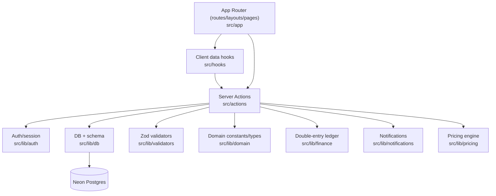
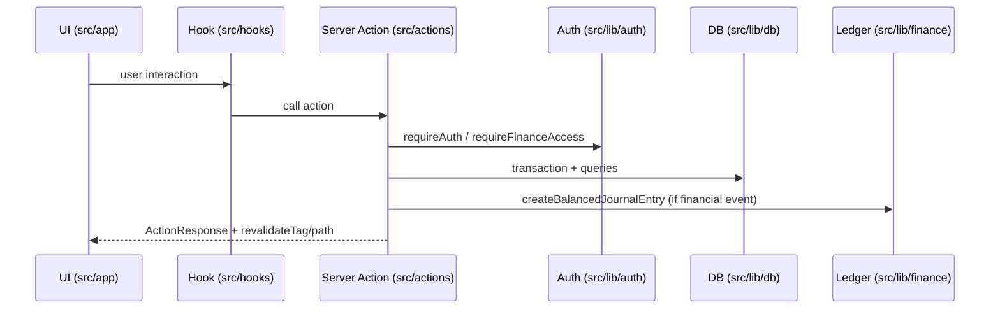

# BOB Solar Code Wiki

This document describes the project architecture, major modules, key functions, dependency relationships, and how to run the system locally.

## Table of Contents

- [Repository Overview](#repository-overview)
- [Architecture](#architecture)
- [Runtime Flow](#runtime-flow)
- [Module Reference](#module-reference)
- [Dependency Map](#dependency-map)
- [Data Model (Database)](#data-model-database)
- [Running Locally](#running-locally)
- [Testing & Quality Gates](#testing--quality-gates)
- [Operational Scripts](#operational-scripts)
- [Where To Start Reading](#where-to-start-reading)

## Repository Overview

**Tech stack**
- Next.js App Router (full-stack): [src/app](file:///c:/bobsolar/src/app)
- TypeScript: [tsconfig.json](file:///c:/bobsolar/tsconfig.json)
- Database: PostgreSQL (Neon serverless) via Drizzle ORM: [src/lib/db](file:///c:/bobsolar/src/lib/db)
- Auth: DB-backed sessions + iron-session cookie sealing: [session.ts](file:///c:/bobsolar/src/lib/auth/session.ts)
- Client data fetching: TanStack Query hooks: [src/hooks](file:///c:/bobsolar/src/hooks)
- Client state: Zustand stores: [src/stores](file:///c:/bobsolar/src/stores)
- PWA/service worker: Serwist + Next integration: [next.config.mjs](file:///c:/bobsolar/next.config.mjs), [sw.ts](file:///c:/bobsolar/src/sw.ts)

**High-level repository map**

```text
bobsolar/
├── src/
│   ├── app/           # Next.js routes/layouts, server components, API routes
│   ├── actions/       # Server Actions (transactional business logic)
│   ├── components/    # Reusable UI components (client and server)
│   ├── hooks/         # TanStack Query wrappers around server actions
│   ├── lib/           # Auth, db, domain constants, finance, utils, validators
│   └── stores/        # Zustand stores
├── drizzle/           # SQL migrations + journal
├── public/            # Static assets + built service worker
├── scripts/           # Operational scripts (run via tsx)
└── docs/              # CODE_WIKI.md only
```

## Architecture

BOB Solar is a full-stack Next.js application. The architecture is intentionally layered so that:
- UI routes are thin and mostly focus on rendering and orchestration
- Server Actions are the main “use-case” layer (permissions + validation + transactions + cache revalidation)
- `src/lib/**` holds reusable domain and infrastructure modules (db/auth/ledger/pricing/etc.)
- Client hooks provide a stable API to the UI for calling Server Actions and managing cache invalidation

### Layered view



### Key architectural conventions

- **Server Actions as the application service layer**: feature modules expose `export async function ...` entry points (often returning an `ActionResponse`) and are protected via auth gates (e.g. [requireAuth](file:///c:/bobsolar/src/lib/auth/validate.ts#L41-L47)).
- **Validation-first**: inputs are parsed using Zod validators under [src/lib/validators](file:///c:/bobsolar/src/lib/validators) and `uuidSchema` parsing under [common validators](file:///c:/bobsolar/src/lib/validators/common.ts).
- **Transactional invariants**: operations that touch inventory, projects, and finance are typically implemented in DB transactions in the relevant Server Action modules (e.g. [project-actions.ts](file:///c:/bobsolar/src/actions/project-actions.ts)).
- **Caching with explicit invalidation**: list reads often use `unstable_cache` with tags, and mutations call `revalidateTag` / `revalidatePath` (example in [quotation-actions.ts](file:///c:/bobsolar/src/actions/quotation-actions.ts#L47-L65)).
- **Concurrency controls**: unique sequences (quote numbers, project numbers) are serialized via advisory locks (see [AdvisoryLock](file:///c:/bobsolar/src/lib/utils/advisory-lock.ts)).
- **Finance is double-entry**: monetary events write balanced journal entries (see [createBalancedJournalEntry](file:///c:/bobsolar/src/lib/finance/ledger.ts#L105-L184)).

## Runtime Flow

The README describes the operational “Solar Flow” (Customers → Inventory → Quotations → Projects → Warranty) ([README.md](file:///c:/bobsolar/README.md#L38-L49)). In code, this roughly maps to:
- Customers: [customer-actions.ts](file:///c:/bobsolar/src/actions/customer-actions.ts) + routes under [src/app/(dashboard)/customers](file:///c:/bobsolar/src/app/(dashboard)/customers)
- Inventory: [inventory-actions.ts](file:///c:/bobsolar/src/actions/inventory-actions.ts) + routes under [src/app/(dashboard)/inventory](file:///c:/bobsolar/src/app/(dashboard)/inventory)
- Quotations: [quotation-actions.ts](file:///c:/bobsolar/src/actions/quotation-actions.ts) + routes under [src/app/(dashboard)/quotations](file:///c:/bobsolar/src/app/(dashboard)/quotations)
- Projects: [project-actions.ts](file:///c:/bobsolar/src/actions/project-actions.ts) + routes under [src/app/(dashboard)/projects](file:///c:/bobsolar/src/app/(dashboard)/projects)
- Finance reporting: modules under [src/actions](file:///c:/bobsolar/src/actions) and pages under [src/app/(dashboard)/finance](file:///c:/bobsolar/src/app/(dashboard)/finance)
- Warranty: [warranty-actions.ts](file:///c:/bobsolar/src/actions/warranty-actions.ts) + routes under [src/app/(dashboard)/warranty](file:///c:/bobsolar/src/app/(dashboard)/warranty)

## Module Reference

### App Router (`src/app`)

**Responsibilities**
- Defines routes, layouts, loading/error boundaries, and route handlers (API endpoints).
- Orchestrates Server Action calls during server renders, and uses client components for interactive areas.

**Key entrypoints**
- Root layout: [layout.tsx](file:///c:/bobsolar/src/app/layout.tsx)
- Dashboard layout (auth-gated): [(dashboard)/layout.tsx](file:///c:/bobsolar/src/app/(dashboard)/layout.tsx)
- Auth pages: [src/app/(auth)](file:///c:/bobsolar/src/app/(auth))
- Upload API route: [route.ts](file:///c:/bobsolar/src/app/api/upload/route.ts)
- PDF routes (server handlers under route segments): [src/app/(dashboard)/quotations/\[id\]/pdf/route.ts](file:///c:/bobsolar/src/app/(dashboard)/quotations/%5Bid%5D/pdf/route.ts), [src/app/(dashboard)/vouchers/\[id\]/pdf/route.ts](file:///c:/bobsolar/src/app/(dashboard)/vouchers/%5Bid%5D/pdf/route.ts)

### Server Actions (`src/actions`)

**Responsibilities**
- Implements all main use cases: permission gates → input validation → DB queries/transactions → side-effects (ledger, notifications) → cache invalidation.

**Common patterns**
- Permissions: [requireAuth](file:///c:/bobsolar/src/lib/auth/validate.ts#L41-L47), [requireAdmin](file:///c:/bobsolar/src/lib/auth/validate.ts#L49-L55), [requireFinanceAccess](file:///c:/bobsolar/src/lib/auth/validate.ts#L57-L63)
- Standardized responses: [action-response.ts](file:///c:/bobsolar/src/lib/utils/action-response.ts)
- Error mapping: [error.ts](file:///c:/bobsolar/src/lib/utils/error.ts)
- Cache invalidation: `revalidatePath`, `revalidateTag` usage (example: [quotation-actions.ts](file:///c:/bobsolar/src/actions/quotation-actions.ts))

**Feature highlights**
- Authentication: [auth-actions.ts](file:///c:/bobsolar/src/actions/auth-actions.ts)
- Inventory: [inventory-actions.ts](file:///c:/bobsolar/src/actions/inventory-actions.ts)
- Quotations: [quotation-actions.ts](file:///c:/bobsolar/src/actions/quotation-actions.ts)
- Projects + costing + inventory consumption: [project-actions.ts](file:///c:/bobsolar/src/actions/project-actions.ts)
- Payments: [payment-actions.ts](file:///c:/bobsolar/src/actions/payment-actions.ts)
- Ledger/journals: [ledger-actions.ts](file:///c:/bobsolar/src/actions/ledger-actions.ts), [manual-journal-actions.ts](file:///c:/bobsolar/src/actions/manual-journal-actions.ts)
- Reports: [profit-loss-actions.ts](file:///c:/bobsolar/src/actions/profit-loss-actions.ts), [cash-movement-actions.ts](file:///c:/bobsolar/src/actions/cash-movement-actions.ts), [receivable-aging-actions.ts](file:///c:/bobsolar/src/actions/receivable-aging-actions.ts)
- Settings (branding + user mgmt): [settings-actions.ts](file:///c:/bobsolar/src/actions/settings-actions.ts)
- Notifications: [notification-actions.ts](file:///c:/bobsolar/src/actions/notification-actions.ts)

### Authentication (`src/lib/auth`)

**Responsibilities**
- Implements DB-backed sessions with encrypted cookie sealing and role-based access gates.

**Key files and functions**
- Session lifecycle: [session.ts](file:///c:/bobsolar/src/lib/auth/session.ts)
  - Startup validation: [assertSessionSecretAtStartup](file:///c:/bobsolar/src/lib/auth/session.ts#L20-L25)
  - Create session row + cookie: [createSession](file:///c:/bobsolar/src/lib/auth/session.ts#L127-L147)
  - Resolve session from cookie + periodic refresh: [getSessionAndRefresh](file:///c:/bobsolar/src/lib/auth/session.ts#L216-L255)
  - Revoke sessions: [revokeAllUserSessions](file:///c:/bobsolar/src/lib/auth/session.ts#L177-L191)
- Access policies: [validate.ts](file:///c:/bobsolar/src/lib/auth/validate.ts)
  - Current-user resolution memoized per request via React `cache()`: [resolveCurrentAuth](file:///c:/bobsolar/src/lib/auth/validate.ts#L25-L39)
  - Guards: [requireAuth](file:///c:/bobsolar/src/lib/auth/validate.ts#L41-L47), [requireAdmin](file:///c:/bobsolar/src/lib/auth/validate.ts#L49-L55), [requireFinanceAccess](file:///c:/bobsolar/src/lib/auth/validate.ts#L57-L63)

### Database (`src/lib/db`) and migrations (`drizzle/`)

**Responsibilities**
- Provides a Neon serverless connection pool and Drizzle client and defines the schema.

**Key files and functions**
- Lazy Drizzle client: [`db`](file:///c:/bobsolar/src/lib/db/index.ts)
- Schema:
  - Central schema definitions: [schema.ts](file:///c:/bobsolar/src/lib/db/schema.ts)
- Seeding:
  - Seed runner: [seed.ts](file:///c:/bobsolar/src/lib/db/seed.ts)
  - Seed config: [seed-config.ts](file:///c:/bobsolar/src/lib/db/seed-config.ts)
- Migration artifacts:
  - SQL migrations: [drizzle/migrations](file:///c:/bobsolar/drizzle/migrations)

### Finance Ledger (`src/lib/finance`)

**Responsibilities**
- Enforces double-entry bookkeeping invariants and provides helpers to post balanced journal entries tied to domain events (payments, costs, conversions).

**Key files and functions**
- Ledger engine: [ledger.ts](file:///c:/bobsolar/src/lib/finance/ledger.ts)
  - Account mapping helpers:
    - [mapPaymentMethodNameToAssetAccount](file:///c:/bobsolar/src/lib/finance/ledger.ts#L44-L54)
    - [mapCostTypeToExpenseAccount](file:///c:/bobsolar/src/lib/finance/ledger.ts#L56-L62)
  - SSoT drift check (payment methods + cost types): [assertFinanceSsotDrift](file:///c:/bobsolar/src/lib/finance/ledger.ts#L64-L82)
  - Balanced journal post: [createBalancedJournalEntry](file:///c:/bobsolar/src/lib/finance/ledger.ts#L105-L184)

### Pricing (`src/lib/pricing`)

**Responsibilities**
- Provides pure calculation logic for quotation totals and line item computations.

**Key file**
- Pricing engine: [engine.ts](file:///c:/bobsolar/src/lib/pricing/engine.ts)

### Notifications (`src/lib/notifications`)

**Responsibilities**
- Writes notifications to the DB (and supports broadcast-like behaviors by inserting per-user notifications).

**Key file**
- Broadcast helpers: [broadcast.ts](file:///c:/bobsolar/src/lib/notifications/broadcast.ts)

### Validators (`src/lib/validators`)

**Responsibilities**
- Defines Zod schemas for every major action input and shared primitives.

**Key examples**
- UUID and numeric helpers: [common.ts](file:///c:/bobsolar/src/lib/validators/common.ts)
- Quotation schemas: [quotation.ts](file:///c:/bobsolar/src/lib/validators/quotation.ts)
- Project schemas: [project.ts](file:///c:/bobsolar/src/lib/validators/project.ts)
- Ledger schemas: [ledger.ts](file:///c:/bobsolar/src/lib/validators/ledger.ts)

### Client data hooks (`src/hooks`)

**Responsibilities**
- Wraps Server Action calls using TanStack Query and standardizes invalidation/toast behavior.

**Key file**
- Hook factories and standardized mutation flow: [mutation-factory.ts](file:///c:/bobsolar/src/hooks/mutation-factory.ts)

### UI components and state (`src/components`, `src/stores`)

**Responsibilities**
- Reusable UI widgets, layout components, PDF HTML templates, and client-side state.

**Notable files**
- App providers (Query client + theme + global handlers): [providers.tsx](file:///c:/bobsolar/src/components/providers.tsx)
- PDF HTML templates:
  - Quotation HTML: [quote-html.tsx](file:///c:/bobsolar/src/components/pdf/quote-html.tsx)
  - Voucher HTML: [voucher-html.tsx](file:///c:/bobsolar/src/components/pdf/voucher-html.tsx)
- Quotation builder store: [quote-builder-store.ts](file:///c:/bobsolar/src/stores/quote-builder-store.ts)

## Dependency Map

### Practical “imports” shape

- `src/app/**` depends on:
  - `src/actions/**` (server-side use cases)
  - `src/components/**` (shared UI)
  - `src/hooks/**` (client-side actions/data)
- `src/actions/**` depends on:
  - `src/lib/auth/**` for access control
  - `src/lib/db/**` for persistence
  - `src/lib/validators/**` for input parsing
  - `src/lib/domain/**` for constants and canonical enums
  - `src/lib/finance/**` for journal posting
  - `src/lib/notifications/**` for side effects
- `src/lib/**` is the “foundation layer” and should not import from `src/app/**` or `src/components/**`.

### End-to-end call flow examples



## Data Model (Database)

The canonical schema is defined in [schema.ts](file:///c:/bobsolar/src/lib/db/schema.ts) and enforced via Drizzle migrations under [drizzle/migrations](file:///c:/bobsolar/drizzle/migrations).

At a conceptual level, the system’s core entities are:
- **Auth**: users, sessions
- **CRM**: customers, suppliers
- **Inventory/Warehouse**: inventory items (unit price, cost price, stock)
- **Sales**: quotations + quotation items (pricing snapshots)
- **Operations**: projects + project costs + remarks
- **Finance**: payment methods, project payments, ledger accounts, journal entries/lines
- **Notifications**: notification rows per recipient
- **Warranty**: warranty alerts tied to projects and due dates

## Running Locally

### Prerequisites
- Node.js v24+
- pnpm v11+ (repo is pinned via `packageManager` in [package.json](file:///c:/bobsolar/package.json#L5))
- A Postgres database (Neon recommended)

### Setup steps

1) Install dependencies

```bash
pnpm install
```

2) Create a local env file

```powershell
Copy-Item .\.env.example .\.env.local
```

3) Configure `.env.local`

See required keys in [.env.example](file:///c:/bobsolar/.env.example). The most important are:
- `DATABASE_URL` (required by [db](file:///c:/bobsolar/src/lib/db/index.ts))
- `SESSION_SECRET` (required by [session.ts](file:///c:/bobsolar/src/lib/auth/session.ts#L12-L18))
- `BLOB_READ_WRITE_TOKEN` (used for Vercel Blob-based uploads)

4) Create/update DB schema

The repository provides migrations:

```bash
pnpm db:migrate
```

5) Seed baseline data

```bash
pnpm db:seed
```

6) Run the dev server

```bash
pnpm dev
```

Open `http://localhost:3000` (matches [README.md](file:///c:/bobsolar/README.md#L90-L99)).

## Testing & Quality Gates

**Unit/integration tests**
- Test runner: Vitest ([vitest.config.mts](file:///c:/bobsolar/vitest.config.mts))
- Tests live under [src/__tests__](file:///c:/bobsolar/src/__tests__) and module-local `__tests__` folders.

**Useful scripts** (from [package.json](file:///c:/bobsolar/package.json#L6-L37))

```bash
pnpm typecheck
pnpm biome:check
pnpm test
pnpm green:code
pnpm test:db
pnpm green
```

`pnpm test:db` runs a connectivity probe + schema push against a test database config and then executes DB-heavy tests (see [package.json](file:///c:/bobsolar/package.json#L28-L35)).

## Operational Scripts

Scripts in [scripts](file:///c:/bobsolar/scripts) are invoked with `tsx` (see [package.json](file:///c:/bobsolar/package.json#L19-L27)). Common ones include:
- DB reset: [db-reset.ts](file:///c:/bobsolar/scripts/db-reset.ts)
- Handover reset/verify: [db-handover-reset.ts](file:///c:/bobsolar/scripts/db-handover-reset.ts), [db-handover-verify.ts](file:///c:/bobsolar/scripts/db-handover-verify.ts)

## Where To Start Reading

- Architecture overview and intended flow: [README.md](file:///c:/bobsolar/README.md)
- Auth model and guards: [validate.ts](file:///c:/bobsolar/src/lib/auth/validate.ts), [session.ts](file:///c:/bobsolar/src/lib/auth/session.ts)
- Database and schema: [db/index.ts](file:///c:/bobsolar/src/lib/db/index.ts), [schema.ts](file:///c:/bobsolar/src/lib/db/schema.ts)
- The core business flows:
  - Quotations: [quotation-actions.ts](file:///c:/bobsolar/src/actions/quotation-actions.ts)
  - Projects + costing + inventory consumption: [project-actions.ts](file:///c:/bobsolar/src/actions/project-actions.ts)
  - Payments: [payment-actions.ts](file:///c:/bobsolar/src/actions/payment-actions.ts)
- Finance engine: [ledger.ts](file:///c:/bobsolar/src/lib/finance/ledger.ts)
