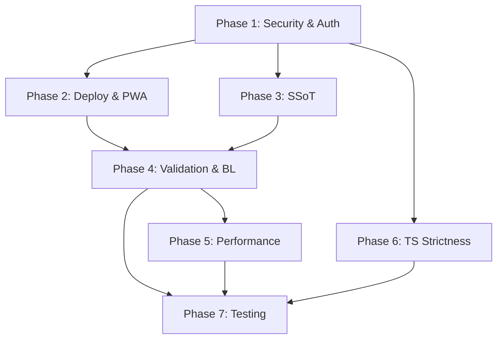

## ✅ User Decisions (Resolved)

| #   | Question         | Decision                                                                                                                          |
| --- | ---------------- | --------------------------------------------------------------------------------------------------------------------------------- |
| 1   | Session strategy | **`iron-session`** (encrypted cookies)                                                                                            |
| 2   | Rate limiting    | **In-memory `Map` with TTL** — sufficient for 3-person team on Vercel                                                             |
| 3   | Access policy    | **All 3 users are equal peers** — no boss/employee hierarchy. Remove strict RBAC gating. All authenticated users get full access. |
| 4   | `proxy.ts`       | **Delete it** — dead code, auth is layout-based                                                                                   |
| 5   | Test database    | **Separate Neon branch**                                                                                                          |

> [!IMPORTANT]
> **Team model change**: Since all 3 users are equal friends with no hierarchy, many of the "admin-gate" fixes from both audits become **unnecessary**. Instead, the fix is simpler: ensure `requireAuth()` is solid (iron-session + signed cookies), and remove misleading admin/staff role distinctions from the UI. The `role` column can stay in the DB for future use but should not block features.

> [!WARNING]
> **Vercel Free Tier Storage Concern**: User has 1GB Blob for photos + 0.5GB for project memory. For a solar CRM with quote PDFs, project photos, and logos, this is tight. Consider: (a) compress images before upload, (b) set max file size policy in `policies.ts`, (c) add a storage usage indicator in settings, (d) plan migration to R2/S3 if growth exceeds limits.

---

## Execution Order & Dependencies

> [!WARNING]
> **Phase 1 must be completed first** — many later fixes (validation, testing) depend on the auth/permission model being correct.

---

## Estimated Effort

| Phase               | Items         | Effort | Priority    |
| ------------------- | ------------- | ------ | ----------- |
| 1 — Security & Auth | 8             | M      | 🔴 Critical |
| 2 — Deploy & PWA    | 6             | M      | 🟠 High     |
| 3 — SSoT            | 6             | M      | 🟡 Medium   |
| 4 — Validation & BL | 10            | L      | 🔵 High     |
| 5 — Performance     | 5             | M      | 🟢 Medium   |
| 6 — TS Strictness   | 5             | S-M    | 🟣 Medium   |
| 7 — Testing         | Full suite    | L      | 🧪 High     |
| **Total**           | **~40 items** | —      |

> [!NOTE]
> Effort reduced from original estimate because RBAC gating (5+ items) is no longer needed — all 3 users are equal peers.

---

## ✅ All Questions Resolved — No Open Questions
