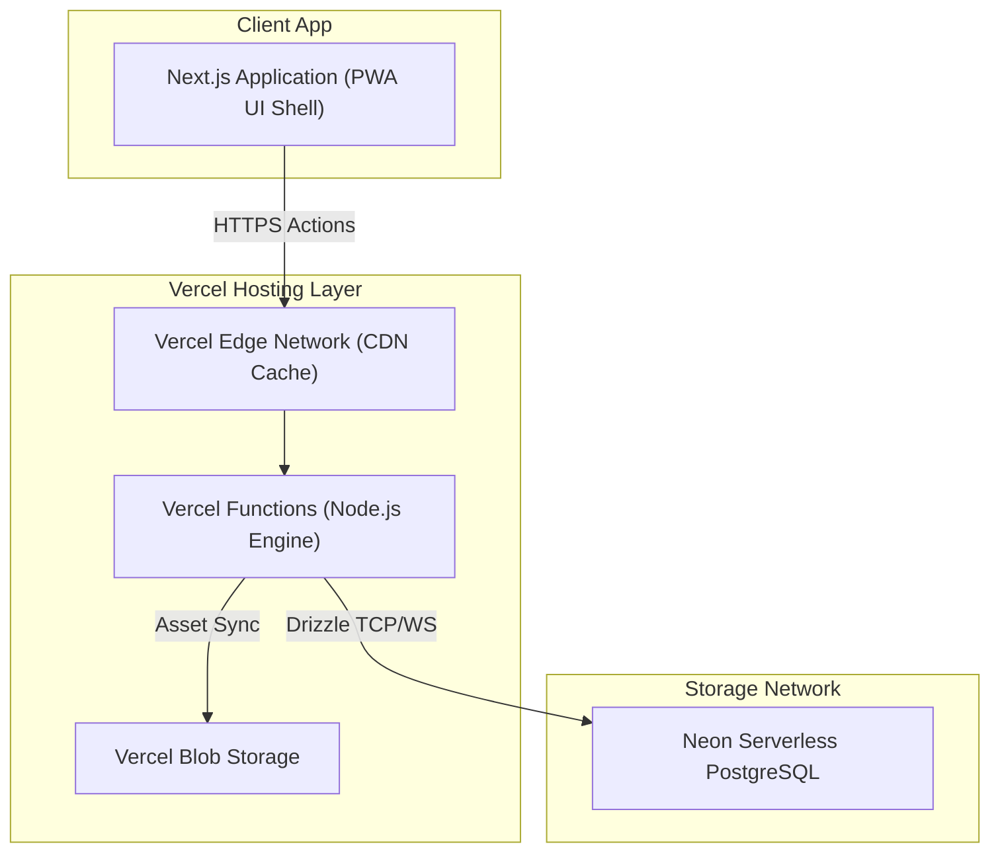
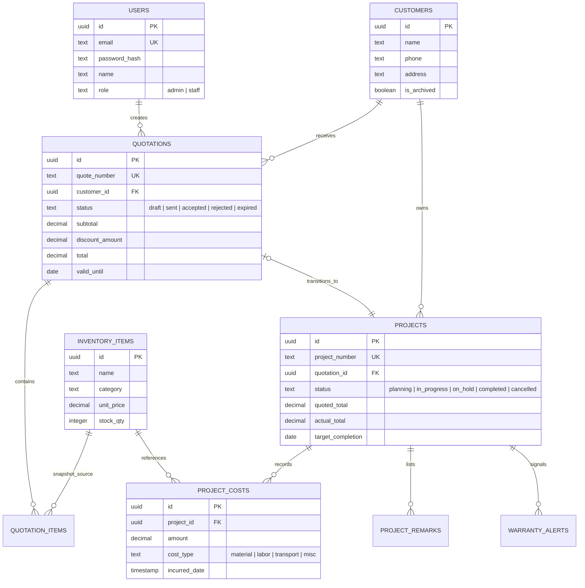
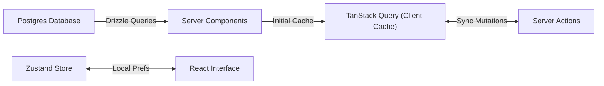

# BOB Solar — System Requirements & Design Specification

**Document Type**: Core Architecture & Design System Specification  
**Application Scope**: Premium, highly visual operational pipeline, quotation engine, and inventory management tool for a boutique solar installation company (**BOB Solar**). Tailored for instantaneous front-end navigation and gorgeous aesthetics.

---

## 1. System Architecture

### Core Technical Stack

| Domain             | Choice                       | Rationale                                                                                    |
| :----------------- | :--------------------------- | :------------------------------------------------------------------------------------------- |
| **Framework**      | Next.js 16.2+ (App Router)   | High-performance React Server Components, server actions, and layout isolation               |
| **Runtime**        | Vercel Functions (Node.js)   | Native Vercel platform target supporting comprehensive backend streaming workflows           |
| **Database**       | Neon Serverless PostgreSQL   | Auto-scaling pooled PostgreSQL instance over serverless WebSocket connection layer           |
| **ORM**            | Drizzle ORM (`pg-core`)      | End-to-end typed schema definitions with zero-overhead runtime compilation                   |
| **Authentication** | Custom Session Engine        | Encrypted DB-backed session management via secure `httpOnly` state cookies                   |
| **Storage**        | Vercel Blob Storage          | Direct-to-bucket asset hosting for user media, customer uploads, and company branding        |
| **PDF Generation** | `@react-pdf/renderer`        | Server-streaming PDF layouts executed inside optimized Node.js Route Handlers                |
| **PWA Capability** | Serwist (`@serwist/next`)    | Native web application offline caching, service workers, and standalone manifest integration |
| **Styling**        | Tailwind CSS / shadcn custom | Optimized CSS utility classes infused with tailored CSS variables and Glassmorphism layers   |

---

## 2. Requirements Specification

### Functional Capabilities

1. **Inventory & Cost Basis Matrix**:
   - Centralized source of truth for items classified by category (`panel`, `inverter`, `battery`, `mounting`, `cable`, `accessory`, `labor`).
   - Dynamic tracking of standard unit prices (Myanmar Kyats - MMK) alongside current stock volume availability.

2. **Quotation Orchestration**:
   - Drag-and-drop line item configuration calculating immediate real-time subtotal, custom percentage discounts, and tax assessments.
   - Immutable line-item pricing snapshots saved into ledger histories upon initial quotation creation to prevent historical variance during future price adjustments.
   - PDF compilation exporting professional customized dossiers featuring company identification, site addresses, linked project parameters, and terms.

3. **Commissioning & Project Handover**:
   - Direct conversions of accepted client quotes into executable project streams equipped with automated project identifiers (e.g., `PJ-2026-0001`).
   - Real-time spend trackers recording itemized labor, logistics, and material disbursements against proposal projections.
   - Automatic triggers comparing live spent values against projected boundaries, generating custom dashboard alert signals upon crossing 10% budget thresholds.

4. **Aftercare & Warranty Choreography**:
   - Tracking customer installation lifecycles post-commissioning.
   - Automated timeline reminders for scheduled panel cleans, system inversions, and hardware warranty expirations.

---

## 3. Database Schema Design

### Entity Relationship Model

---

## 4. UI/UX "Solar Flow" Design System

### Design Philosophy

**"Solar Flow"** delivers an atmospheric, high-fidelity user interface built around clean typography, sleek glassmorphism panels, hardware-accelerated micro-animations, and fluid CSS states. It bypasses generic admin sidebars in favor of focused orbital interaction points.

### Token Layer

- **Primary Radiance**: Rich Amber (`#F59E0B` to `#FBBF24`) layered onto deep solar orange gradient strokes.
- **Energy Flow**: Mint and Emerald visual elements highlighting positive capacity growth and finalized commissioning dossiers.
- **Surfaces**: Ultra-clean warm white backgrounds in light mode, switching smoothly to luxurious dark layouts equipped with subtle border illumination lines.

### Core Layout Navigation

- **Orbital Dock**: Floating bottom navigation dock keeping main functional paths instantaneously reachable via glowing visual state triggers.
- **Global Command Palette (`⌘K`)**: Rapid keyboard-driven index access mapping directly to specific project files, client search records, and asset registration sheets.

---

## 5. State Management & Lifecycle

1. **Server Rendering Isolation**: Structural layout headers, authentication verifications, and global database summaries evaluate directly as Server Components.
2. **Client Component Islands**: Search input filters, real-time calculation arrays, and active orbital dock triggers run as targeted Client Components using memoized states.
3. **Synchronized Client Cache**: TanStack Query handles active record invalidations, optimistic state patches, and multi-query concurrent parallelization (`Promise.all`) across dashboard route interactions.
