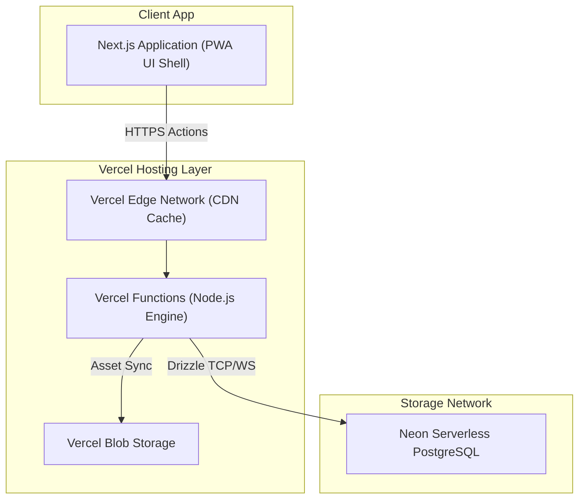
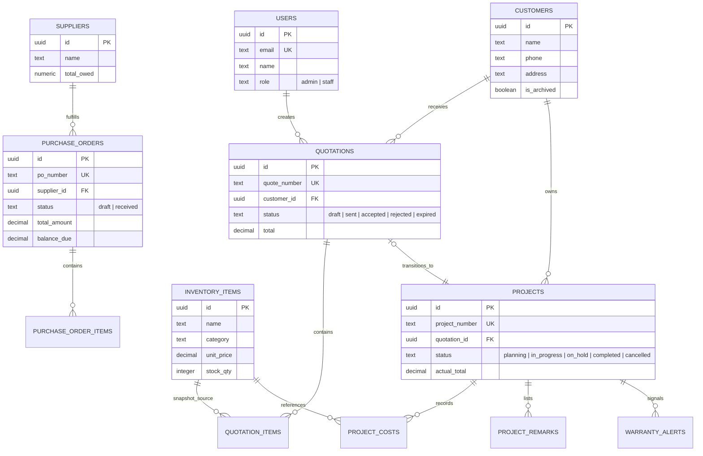
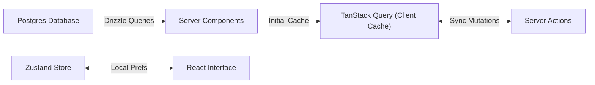

# BOB Solar — System Requirements & Design Specification

**Document Type**: Core Architecture & Design System Specification  
**Application Scope**: Premium, highly visual operational pipeline, quotation engine, and inventory management tool for a boutique solar installation company (**BOB Solar**). Tailored for instantaneous front-end navigation and gorgeous aesthetics.

---

## 1. System Architecture

### Core Technical Stack

| Domain             | Choice                       | Rationale                                                                                    |
| :----------------- | :--------------------------- | :------------------------------------------------------------------------------------------- |
| **Framework**      | Next.js 16.2+ (App Router)   | High-performance React Server Components, server actions, and layout isolation               |
| **Runtime**        | Vercel Functions (Node.js)   | Native Vercel platform target supporting comprehensive backend streaming workflows           |
| **Database**       | Neon Serverless PostgreSQL   | Auto-scaling pooled PostgreSQL instance over serverless WebSocket connection layer           |
| **ORM**            | Drizzle ORM (`pg-core`)      | End-to-end typed schema definitions with zero-overhead runtime compilation                   |
| **Authentication** | Custom Session Engine        | Encrypted DB-backed session management via secure `httpOnly` state cookies                   |
| **Storage**        | Vercel Blob Storage          | Direct-to-bucket asset hosting for user media, customer uploads, and company branding        |
| **PDF Generation** | `@react-pdf/renderer`        | Server-streaming PDF layouts executed inside optimized Node.js Route Handlers                |
| **PWA Capability** | Serwist (`@serwist/next`)    | Native web application offline caching, service workers, and standalone manifest integration |
| **Styling**        | Tailwind CSS / shadcn custom | Optimized CSS utility classes infused with tailored CSS variables and Glassmorphism layers   |

---

## 2. Requirements Specification

### Functional Capabilities

1. **Item Catalog & Pricing Matrix (SSoT)**:
   - Centralized source of truth for items classified by category (`panel`, `inverter`, `battery`, `mounting`, `cable`, `accessory`, `labor`, `service`).
   - Dynamic tracking of standard unit prices (Myanmar Kyats - MMK) alongside current stock volume availability.

2. **Supplier & Procurement Hub**:
   - Master ledger for Suppliers and Accounts Payable.
   - Purchase Order engine mapped directly to Catalog items. Receiving POs automatically increments Warehouse stock and handles Double-Entry Journal ledgers.

3. **Quotation Orchestration**:
   - Drag-and-drop line item configuration calculating immediate real-time subtotal, custom percentage discounts, and tax assessments.
   - Immutable line-item pricing snapshots saved into ledger histories upon initial quotation creation to prevent historical variance during future price adjustments.
   - PDF compilation exporting professional customized dossiers featuring company identification, site addresses, linked project parameters, and terms.

4. **Commissioning & Project Handover**:
   - Direct conversions of accepted client quotes into executable project streams equipped with automated project identifiers (e.g., `PJ-2026-0001`).
   - Real-time spend trackers recording itemized labor, logistics, and material disbursements against proposal projections.
   - Automatic triggers comparing live spent values against projected boundaries, generating custom dashboard alert signals upon crossing 10% budget thresholds.

5. **Aftercare & Warranty Choreography**:
   - Tracking customer installation lifecycles post-commissioning.
   - Automated timeline reminders for scheduled panel cleans, system inversions, and hardware warranty expirations.

---

## 3. Database Schema Design

### Entity Relationship Model

---

## 4. UI/UX "Solar Flow" Design System

### Core Philosophy

This design system prioritizes **readability, context, and professionalism**. It moves away from the common 'Solar' tropes (overuse of yellow, literal energy flows) in favor of a clean, enterprise-grade aesthetic inspired by the design languages of Apple, GitHub, and Google.

### Visual Principles

- **Minimalist & Immersive**: Move away from traditional 'Sidebar + Content' layouts. Use an immersive, top-down flow or a floating navigation 'Dock' to maximize the data canvas.
- **Bento-Style Grid**: Organize information into a beautiful mosaic of varying-sized modules. This creates a rhythmic, modern look that remains highly functional.
- **Micro-Interaction Rhythm**: Every interaction should have a subtle, high-quality response. Use 'weighty' transitions—short durations (150-200ms) with elegant easing—to make the interface feel alive but stable.
- **Less is More**: Every element must have a purpose. Remove decorative blurs, glass effects, and heavy animations that impact performance.
- **Context First**: Data and information are the stars. Navigation and structure should be supportive but subtle.

### Token Layer & Color Palette

- **Primary (Deep Navy)**: `#0F172A` - Used for main headings, navigation, and structural elements. Conveys trust and stability.
- **Secondary (Solar Gold)**: `#D97706` / `#F59E0B` - Used sparingly for key calls to action and critical status indicators. A more sophisticated, muted amber than literal yellow.
- **Energy Flow**: Mint and Emerald visual elements highlighting positive capacity growth and finalized commissioning dossiers.
- **Background (Soft Slate)**: `#F8FAFC` - A clean, off-white surface that reduces eye strain and looks premium, switching smoothly to luxurious dark layouts.
- **Borders**: `#E2E8F0` - Subtle, thin borders to define sections without adding visual weight.

### Typography & Shapes

- **Primary Font**: `Inter` or `Outfit`.
- **Headings**: Semi-bold, deep navy, with tight tracking for a modern look.
- **Body**: Regular weight, optimized for legibility with proper line height.
- **Radius**: `12px` (Medium Rounded) - Provides a modern, friendly feel while maintaining professional structure.
- **Shadows**: Very subtle, soft shadows (e.g., `0 1px 3px rgba(0,0,0,0.05)`) to create depth without using blur effects.

### Core Layout Navigation

- **Orbital Dock**: Floating bottom navigation dock keeping main functional paths instantaneously reachable via glowing visual state triggers.
- **Global Command Palette (`⌘K`)**: Rapid keyboard-driven index access mapping directly to specific project files, client search records, and asset registration sheets.
- **Bento Stat Cards**: Flat surfaces with thin borders, arranged in a grid with varying aspect ratios to create visual interest.
- **Custom Data Viz**: Move away from generic charts. Use custom, minimal SVG paths in Deep Navy and Solar Gold to tell 'Energy Stories'—high precision, zero clutter.

---

## 5. State Management & Lifecycle

1. **Server Rendering Isolation**: Structural layout headers, authentication verifications, and global database summaries evaluate directly as Server Components.
2. **Client Component Islands**: Search input filters, real-time calculation arrays, and active orbital dock triggers run as targeted Client Components using memoized states.
3. **Synchronized Client Cache**: TanStack Query handles active record invalidations, optimistic state patches, and multi-query concurrent parallelization (`Promise.all`) across dashboard route interactions.
